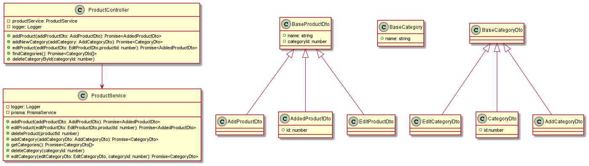

### Схема базы данных приложения


### Диаграмма классов модуля prisma


### Диаграмма классов модуля auth


### Диаграмма классов модуля user


### Диаграмма классов модуля measurement-unit


### Диаграмма классов модуля product



### Диаграмма классов модуля purchased-product


## Установка

```bash
$ npm install
```

## Запуск приложения

```bash
# development
$ npm run start

# watch mode
$ npm run start:dev

# production mode
$ npm run start:prod
```
