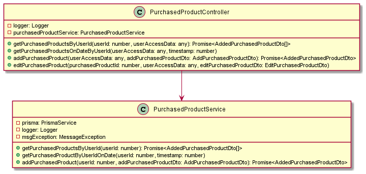

## Схема базы данных приложения


## Диаграммы классов

<details>
<summary>Модуля</summary>

### Диаграмма классов модуля prisma


### Диаграмма классов модуля auth


### Диаграмма классов модуля user


### Диаграмма классов модуля measurement-unit


### Диаграмма классов модуля product


### Диаграмма классов модуля purchased-product



</details>

## Диаграммы операций

<details>
<summary>подробнее</summary>

#### Заинтересованные стороны

1. Пользователь - чтобы отслеживать свои траты

### Зарегистрироваться

#### Пред.условия:

#### Пост.условия:

1. Пользователь зарегистрирован


### Войти в систему

#### Пред.условия:

1. Пользователь зарегистрирован

#### Пост.условия:

1. Пользовател вошел в систему


### Добавить новую категорию

#### Пред.условия:

1. Пользователь зарегистрирован
2. Добавляемой категории нет в системе

#### Пост.условия:

1. Добавлена новая категория


### Добавить новую единицу измерения

#### Пред.условия:

1. Пользователь зарегистрирован
2. Добавляемой еденицы измерения нет в системе

#### Пост.условия:

1. Добавлена новая единица измерения


### Добавить новый продукт

#### Пред.условия:

1. Пользователь зарегистрирован
2. Добавляемого продукта нет в системе

#### Пост.условия:

1. Добавлен новый продукт


### Добавить запись о купленном продукте

#### Пред.условия:

1. Пользователь зарегистрирован

#### Пост.условия:

1. Добавлена запись о купленном продукте


### Удалить категорию

#### Пред.условия:

1. Пользователь зарегистрирован
2. Нет добавленных продуктов для выбранной категории
3. Пользователь является администратором

#### Пост.условия:

1. Категория удалена


### Удалить единицу измерения

#### Пред.условия:

1. Пользователь зарегистрирован
2. Нет добавленных продуктов для выбранной единицы измерения
3. Пользователь является администратором

#### Пост.условия:

1. Еденица измерения удалена


### Удалить продукт

#### Пред.условия:

1. Пользователь зарегистрирован
2. Нет записей о добавленных продуктах для удаляемого продукта
3. Пользователь является администратором

#### Пост.условия:

1. Продукт удален


### Удалить купленный продукт

#### Пред.условия:

1. Пользователь зарегистрирован

#### Пост.условия:

1. Купленный продукт удален


### Редактирование категории

#### Пред.условия:

1. Пользователь зарегистрирован
2. Категория существует

#### Пост.условия:

1. Категория отредактирована


### Редактирование продукта

#### Пред.условия:

1. Пользователь зарегистрирован
2. Продукт существует
3. Пользователь является администратором

#### Пост.условия:

1. Продукт отредактирован


### Редактирование купленного продукта

#### Пред.условия:

1. Пользователь зарегистрирован
2. Продукт существует
3. Пользователь редактирует свой купленный продукт

#### Пост.условия:

1. Купленный продукт отредактирован


### Получить список категорий

#### Пред.условия:

1. Пользователь зарегистрирован

#### Пост.условия:

1. Список категорий


### Получить список едениц измерения

#### Пред.условия:

1. Пользователь зарегистрирован

#### Пост.условия:

1. Список едениц измерения


### Получить список продуктов

#### Пред.условия:

1. Пользователь зарегистрирован

#### Пост.условия:

1. Список продуктов


### Получить список купленных продуктов в выбранную дату

#### Пред.условия:

1. Пользователь зарегистрирован

#### Пост.условия:

1. Список купленных продуктов в выбранную дату


</details>

## Установка

```bash
$ npm install
```

## Запуск приложения

```bash
# development
$ npm run start

# watch mode
$ npm run start:dev

# production mode
$ npm run start:prod
```
